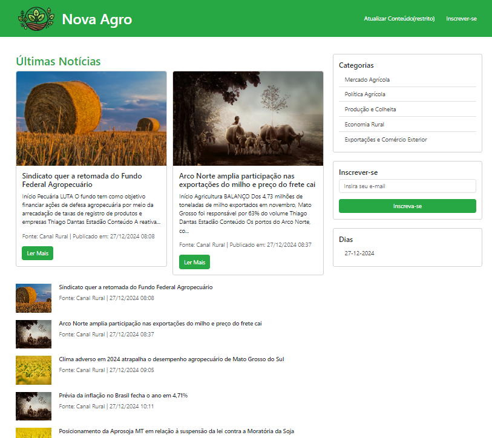

# AgroScrapping

AgroScrapping é um site desenvolvido para coletar notícias relevantes sobre o setor agropecuário de diversos sites, utilizando um web crawler. Além disso, ele faz integração com uma API de banco de imagens, garantindo que todas as notícias possuam imagens ilustrativas.

## 🚀 Tecnologias Utilizadas

O projeto foi desenvolvido com as seguintes tecnologias e dependências:

- [Node.js](https://nodejs.org/)
- [Axios](https://axios-http.com/)
- [Body-Parser](https://www.npmjs.com/package/body-parser)
- [Bootstrap](https://getbootstrap.com/)
- [Cheerio](https://cheerio.js.org/)
- [EJS](https://ejs.co/)
- [Express](https://expressjs.com/)
- [jQuery](https://jquery.com/)
- [JSDOM](https://github.com/jsdom/jsdom)
- [Knex.js](http://knexjs.org/)
- [MySQL2](https://www.npmjs.com/package/mysql2)
- [Router](https://www.npmjs.com/package/router)

## 🌟 Funcionalidades

- **Coleta Automática de Notícias:** O web crawler busca notícias relevantes sobre o setor agropecuário em diversos sites confiáveis.
- **Atualização Manual:** Permite que os usuários atualizem as notícias manualmente.
- **Integração com API de Imagens:** Adiciona imagens automaticamente às notícias, mantendo um layout visual agradável e informativo.

## 📖 Pontos de Melhoria

### Integração com OpenAI API
- Adicionar a funcionalidade para gerar resumos personalizados e simplificados das notícias.

### Aprimorar a API de Imagens
- Corrigir problemas onde imagens podem não estar relacionadas ao conteúdo.

## 🖼️ Layout
- O site utiliza o Bootstrap para garantir um design responsivo e moderno.
- Além disso, ele integra imagens relevantes às notícias de forma automática.

